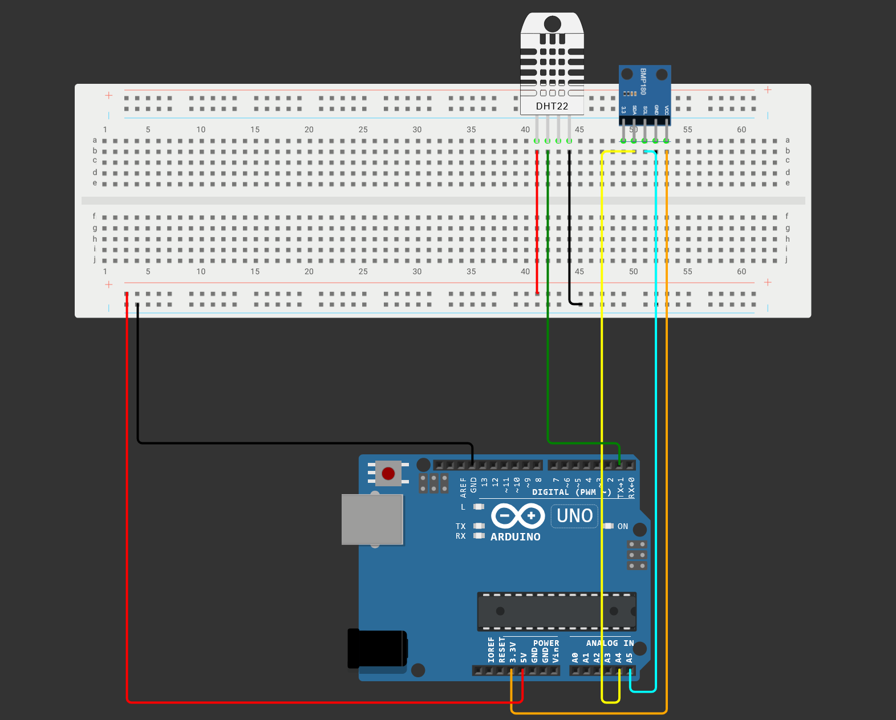

# Sistema-de-Medicao-de-Estacao-Meteorologica-IoT
O objetivo central deste repositório é construir um sistema completo de ponta a ponta: um dispositivo físico simulando uma estação meteorológica envia dados para um servidor web, que os armazena em banco de dados e os disponibiliza em uma interface de visualização.

## Estrutura do Projeto

O projeto é dividido em três componentes principais:
1. **Dispositivo Físico (Arduino):** Lê os dados dos sensores e envia pela porta serial.
2. **Coletor Serial (`src/serial_reader.py`):** Script em Python que captura as leituras da porta serial e faz um envio (HTTP POST) para o servidor Web.
3. **Servidor Web (`src/app.py`):** Aplicação feita em Flask que gerencia o fluxo de dados em um banco de dados SQLite, expõe uma API RESTful e serve uma interface HTML/CSS/JS para visualização.

## Instalação e Configuração

1. Clone o repositório e acesse a pasta do servidor base:
   ```bash
   # Clonar o repositório
   git clone <sua-url-do-repositorio>
   
   # Navegar até a pasta raiz
   cd Sistema-de-Medicao-de-Estacao-Meteorologica-IoT
   ```

2. Pelo terminal do sistema, entre no diretório fonte d projeto e configure um ambiente virtual para o Python:
   ```bash
   cd src
   python -m venv .venv
   ```

3. Ative o ambiente virtual para baixar os pacotes:
   - No Windows: `source .venv/Scripts/activate`
   - No Linux/Mac: `source .venv/bin/activate`

4. Instale as bibliotecas necessárias:
   ```bash
   pip install -r requirements.txt
   ```

5. Configure suas variáveis de ambiente locais (portas iterativas e URLs) duplicando o arquivo base de configurações:
   - Renomeie o arquivo `src/.env.example` para `src/.env`
   - Usando seu editor, edite os campos com os valores corretos. Fica aproximadamente assim:
     ```ini
     PORTA=COM3
     BAUD_RATE=9600
     URL=http://127.0.0.1:5000/leituras
     ```

## Execução

O sistema necessita que o servidor Python web esteja rodando junto com o leitor serial:

1. **Subir o Servidor Web (App e Banco de dados):**
   Com o ambiente virtual ativado no diretório `src/`, execute o App. (Sua primeira execução cria o base de dados `dados.db` automaticamente):
   ```bash
   python app.py
   ```
   > Acesse o Dashboard de Monitoramento no navegador web local usando a rota: [http://127.0.0.1:5000/](http://127.0.0.1:5000/)

2. **Subir o Leitor Serial:**
   Abra um novo terminal dentro da pasta `src/`, repita o procedimento de ativação do seu `venv` e execute o script leitor:
   ```bash
   python serial_reader.py
   ```
   > Observação: a placa MicroControladora (Ex: Arduino) com o código (`src/arduino/estacao/estacao.ino`) precisar estar ativada na porta USB do PC onde roda o script.

## Descrição das Rotas (Endpoints)

A aplicação Flask expõe rotas para navegação visual em HTML e controle de dados internos via API Rest.

### Rotas Web (Visualização)
- **`GET /`** ou **`GET /dashboard`**: Redirecionam/retornam para o painel principal na renderização do "index.html". Exibe estatísticas, tendências e atualizações.
- **`GET /historico`**: Renderiza a página "historico.html" com dados de histórico geral.
- **`GET /editar/<id>`** / **`POST /editar/<id>`**: Página "editar.html", um formulário de alteração manual dos valores de temperatura, umidade e/ou pressão salvos por ID.

### Rotas de API (Comunicação em JSON)
- **`GET /ultimas`**: Devolve um array JSON com as últimas 10 leituras registradas no banco (em ordem mais recente para mais velha).
- **`GET /leituras`**: Recupera e envia toda a base de leituras armazenadas organizadas pelo "timestamp".
- **`POST /leituras`**: Rota principal consumida pelo serviço leitor da serial (*serial_reader.py*). Insere as leituras de *temperatura*, *umidade* e *pressao*.
- **`GET /leituras/<id>`**, **`PUT /leituras/<id>`**, **`DELETE /leituras/<id>`**: API CRUD individual por ID. (Respectivamente servem para: Consultar uma única leitura, atualizar por JSON payload e apagar um registro).
- **`GET /api/estatisticas`**: Devolve agregações base do banco como médias (AVG), valores mínimos (MIN) e valores máximos (MAX) capturados em toda a base da aplicação (ajuda a preencher os visuais da dashboard principal).

## Circuito


